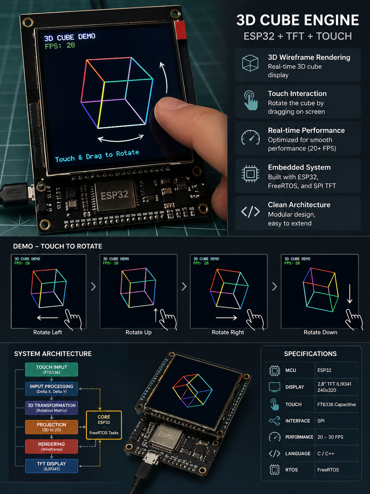
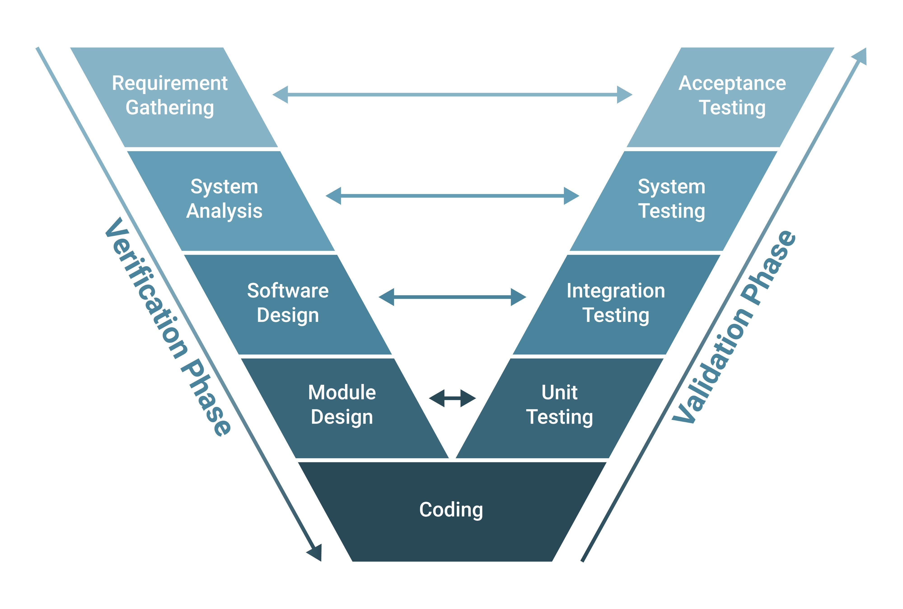

# 🚀 Hệ Thống Đồ Họa 3D trên ESP32 + TFT ILI9341

> **Mục tiêu:** Xây dựng hệ thống render khối lập phương 3D tương tác trên ESP32, cho phép người dùng xoay khối theo thời gian thực thông qua thao tác trên màn hình cảm ứng.

<p align="center">
  
</p>


## 📋 Mục Lục

- [⚙️ Quy Trình Phát Triển Sản Phẩm (V-Model)](#-quy-trình-phát-triển-sản-phẩm-v-model)
- [📌 Tổng Quan](#-tổng-quan)
- [🧠 Kiến Trúc Hệ Thống](#-kiến-trúc-hệ-thống)
- [📁 Cấu Trúc Project](#-cấu-trúc-project)
- [⚙️ Yêu Cầu Hệ Thống](#-yêu-cầu-hệ-thống)
- [🔧 Hướng Dẫn Build](#-hướng-dẫn-build)
- [🧩 Thành Phần Chính](#-thành-phần-chính)
- [🎥 Ví Dụ và Demo](#-ví-dụ-và-demo)
- [📚 Tài Liệu Tham Khảo](#-tài-liệu-tham-khảo)
- [📄 License](#-license)

## [⚙️ Quy Trình Phát Triển Sản Phẩm (V-Model)](#-quy-trình-phát-triển-sản-phẩm-v-model)
<p align="center">
  
</p>

### ⚙️ Cách làm việc: Phương pháp V-Model

Để chạy được 3D trên ESP32 mà không bị crash, chúng tôi sử dụng một phiên bản V-Model đơn giản hóa. Nguyên tắc cốt lõi: Nghĩ kỹ, code nhanh, test sớm.

### 1. Thiết kế trước, code sau (Nhánh trái)
* **Kiến Trúc:** Thống nhất cấu trúc thư mục, Sơ đồ Task FreeRTOS, Thiết kế Hardware Abstraction Layer (HAL), 
* **Tài Liệu:** Tạo thư mục docs/ quản lý tài liệu, Thống nhất API Template để comment code, mô tả input/output của mỗi hàm.
* **Thuật Toán và Logic:** Flowchart Render 3D, SPI Timing & Config

### 2. Code có kỷ luật (Phần đáy)
* **Thiết lập kho lưu trữ GitHub:** Khởi tạo Repo, tạo sẵn các nhánh main, develop, phân vùng phân quyền. (Quy định Pull Request)
* **Quy ước lập trình:** Chốt quy tắc đặt tên, định nghĩa các quy tắt, cách kiểm tra các quy tắc (Phần toán 3D được tách hoàn toàn khỏi driver hiển thị ILI9341)

### 3. Test từng bước (Nhánh phải)
* **Test thuật toán trên PC trước:** Setup môi trường PC, Viết kịch bản test ma trận.
* **Test tích hợp & Hiệu năng:** Viết Task Monitor, Test màn hình cơ bản, Tích hợp Touch - Render
* **Theo dõi hệ thống:** Log liên tục qua Serial để phát hiện tụt FPS và kiểm tra bộ nhớ heap (truy vết memory leak).
* **CI/CD (Tự động hóa):** Cấu hình GitHub Actions

### 🗣️ Quy tắc team:
* **Cách báo cáo tiến độ:**
* **Cách báo cáo vấn đề:**
* **Cách tạo nhiệm vụ:**
* **Định nghĩa nhiệm vụ đã hoàn thành:**
* **Quy tắc sử dụng Git:**


## [📌 Tổng Quan](#-tổng-quan)
## [🧠 Kiến Trúc Hệ Thống](#-kiến-trúc-hệ-thống)
```text
┌─────────────────────────────────────────────────────────────┐
│                      APPLICATION LAYER                      │
│                    (Luồng điều khiển chính)                 │
│  ┌──────────────┐  ┌────────────────────────────────┐       │
│  │ App_3D_Cube  │  │App_Touch_Cal       Sys_Monitor │       │
│  │   (main.c)   │  │(Hiệu chỉnh) (Tests) (FPS/Heap) │       │
│  └──────────────┘  └────────────────────────────────┘       │
│  ┌──────────────────────────────────────────────────┐       │
│  │             FreeRTOS Task Management             │       │
│  │  - Task_Display (Đẩy Framebuffer ra màn hình)    │       │
│  │  - Task_Math3D  (Tính toán tọa độ, xoay góc)     │       │
│  │  - Task_Touch   (Đọc chạm, đẩy data vào Queue)   │       │
│  └──────────────────────────────────────────────────┘       │
└─────────────────────────────────────────────────────────────┘
       │ (Giải thuật phần mềm)                 │ (Chương trình điều kiển phần cứng)
       ▼                                       ▼
┌───────────────────────────┐   ┌─────────────────────────────┐
│3D CORE ENGINE (MIDDLEWARE)│   │  UNIFIED DRIVERS (NGOẠI VI) │
│ (Chỉ xử lý số liệu ở RAM) │   │  (Độc lập hoàn toàn chip)   │
│┌────────────┐┌───────────┐│   │┌────────────┐┌─────────────┐│
││  3D Math   ││Rasterizer ││   ││  ILI9341   ││   XPT2046   ││
││(Matrix/Vec)││(Wireframe)││   ││(TFT Render)││(Đọc tọa độ) ││
│└────────────┘└───────────┘│   │└────────────┘└─────────────┘│
└───────────────────────────┘   └─────────────────────────────┘
                                              │ (Gọi Giao diện ảo)
                                              ▼
┌─────────────────────────────────────────────────────────────┐
│            FRONTEND APIs (HAL V-TABLE INTERFACES)           │
│           (Lớp layer chung để điều khiển ngoại vi)          │
│  ┌──────────────┐  ┌──────────────┐  ┌──────────────┐       │
│  │  hal_spi.h   │  │  hal_i2c.h   │  │ hal_gpio.h   │       │
│  │(transmit_cmd)│  │ (read/write) │  │ (set_level)  │       │
│  └──────────────┘  └──────────────┘  └──────────────┘       │
└─────────────────────────────────────────────────────────────┘
                            │
                            ▼
┌─────────────────────────────────────────────────────────────┐
│               BACKEND SPECIFIC (TARGETS / BSP)              │
│                (Code bị khóa chặt vào Chipset)              │
│  ┌──────────────┐  ┌──────────────┐  ┌──────────────┐       │
│  │ TARGET: ESP32│  │ TARGET: STM32│  │  TARGET: PC  │       │
│  │ (ESP-IDF API)│  │ (STM32 HAL)  │  │ (SDL2/OpenGL)│       │
│  └──────────────┘  └──────────────┘  └──────────────┘       │
└─────────────────────────────────────────────────────────────┘
                            │
                            ▼
            ┌─────────────────────────────┐
            │      PHYSICAL HARDWARE      │
            └─────────────────────────────┘
```
## [📁 Cấu Trúc Project](#-cấu-trúc-project)
```text
embedded_3d_platform/
│
├── core_engine/                    # 1. MIDDLEWARE: Bộ não logic 3D (Độc lập phần cứng)
│   ├── include/engine/
│   │   ├── math_3d.h               # Định nghĩa Vector3D, Matrix4x4
│   │   └── render_pipeline.h       # Giao diện đồ họa (Rasterization)
│   ├── src/
│   │   ├── math/
│   │   │   ├── matrix.c            # Nhân ma trận, phép chiếu (Projection)
│   │   │   └── vector.c            # Tính toán vector (Dot, Cross product)
│   │   └── graphics/
│   │       ├── wireframe.c         # Thuật toán vẽ đường thẳng (Bresenham)
│   │       └── framebuffer.c       # Quản lý mảng pixel trên RAM
│   └── CMakeLists.txt              # Build target: libcore.a
│
├── drivers/                        # 2. TẦNG PHẦN CỨNG (Unified Hardware Layer)
│   ├── include/                    # FRONTEND APIs: Ranh giới phần cứng (Giao diện ảo)
│   │   ├── hal_spi.h               # Struct V-Table cho SPI (transmit_cmd, transmit_data)
│   │   ├── display_api.h           # API điều khiển màn hình dùng chung
│   │   └── touch_api.h             # API lấy tọa độ chạm
│   │
│   ├── devices/                    # THIẾT BỊ NGOẠI VI: Code độc lập Chipset
│   │   ├── ili9341.c               # Điều khiển ILI9341 (chỉ gọi API từ hal_spi.h)
│   │   └── xpt2046.c               # Điều khiển cảm ứng XPT2046
│   │
│   ├── targets/                    # BACKEND SPECIFIC: Code dính chặt vào vi điều khiển
│   │   ├── esp32/                  
│   │   │   ├── spi_esp32.c         # Code cấu hình thanh ghi SPI dùng ESP-IDF
│   │   │   └── board_config.h      # Khai báo các chân PIN (MISO, MOSI, CS...)
│   │   └── stm32/                  
│   │       ├── spi_stm32.c         # Code cấu hình SPI dùng STM32 HAL/LL
│   │       └── board_config.h      
│   │
│   └── CMakeLists.txt              # Tự động chọn file trong targets/ để build libdrivers.a
│
├── common/                         # 3. TIỆN ÍCH DÙNG CHUNG (Cross-cutting)
│   ├── include/common/
│   │   ├── logger.h                # Hệ thống Macro LOG_INFO, LOG_ERROR
│   │   ├── math_utils.h            # Hàm phụ trợ: map(), constrain(), bitwise
│   │   └── system_errors.h         # Mã lỗi chuẩn hóa (Error codes)
│   ├── src/
│   │   └── logger.c                # Xử lý logic in Log ra Serial
│   └── CMakeLists.txt              # Build target: libcommon.a
│
├── tests/                          # 4. CHƯƠNG TRÌNH THỰC THI & KIỂM THỬ (Nơi chứa main.c)
│   ├── host_tests/                 # Chạy trực tiếp trên PC (không cần MCU)
│   │   ├── test_math_3d.c          # Unit test kiểm tra độ chính xác ma trận xoay
│   │   └── CMakeLists.txt
│   │
│   └── target_tests/               # Chạy trên vi điều khiển (MCU)
│       ├── test_3d_cube/           # App 1: Render khối 3D (Đây chính là firmware chính)
│       │   ├── src/
│       │   │   ├── task_display.c  # FreeRTOS Task đẩy Framebuffer ra LCD
│       │   │   └── task_math_3d.c  # FreeRTOS Task tính toán góc xoay
│       │   ├── main.c              # Điểm Entry: Nơi "Tiêm" phụ thuộc (Inject SPI vào LCD)
│       │   └── CMakeLists.txt      # Build ra file nạp (.bin / .elf)
│       │
│       └── test_touch_calib/       # App 2: Hiệu chỉnh cảm ứng (Calibration)
│           ├── main.c              # Chương trình độc lập để lấy điểm min/max cảm ứng
│           └── CMakeLists.txt
│
├── tools/                          # 5. CÔNG CỤ HỖ TRỢ PHÁT TRIỂN
│   ├── pc_simulator/               # Dùng SDL2 để xem trước giao diện trên máy tính
│   └── monitor_fps.py              # Script vẽ biểu đồ FPS realtime từ Serial
│
├── docs/                           # 6. TÀI LIỆU DỰ ÁN
│   ├── hardware/                   # Datasheet, Pinout map
│   └── doxygen_config/             # Sinh tài liệu API tự động
│
├── .gitignore
├── sdkconfig.defaults              # Cấu hình tần số CPU, kích thước bộ nhớ cho ESP-IDF
└── CMakeLists.txt                  # Root CMake: Gọi các thư mục con và thiết lập Flags
```
## [⚙️ Yêu Cầu Hệ Thống](#-yêu-cầu-hệ-thống)
### Phần Cứng
- **CPU**:
- **RAM**: 
- **Camera**:

### Phần Mềm
- **OS**:
- **Compiler**:
- **CMake**:
- **Libraries**:


### Cho Development
- Git
- Make / Ninja
- (Optional)

## [🔧 Hướng Dẫn Build](#-hướng-dẫn-build)
## [🧩 Thành Phần Chính](#-thành-phần-chính)
## [🎥 Ví Dụ và Demo](#-ví-dụ-và-demo)
## [📚 Tài Liệu Tham Khảo](#-tài-liệu-tham-khảo)
## [📄 License](#-license)

